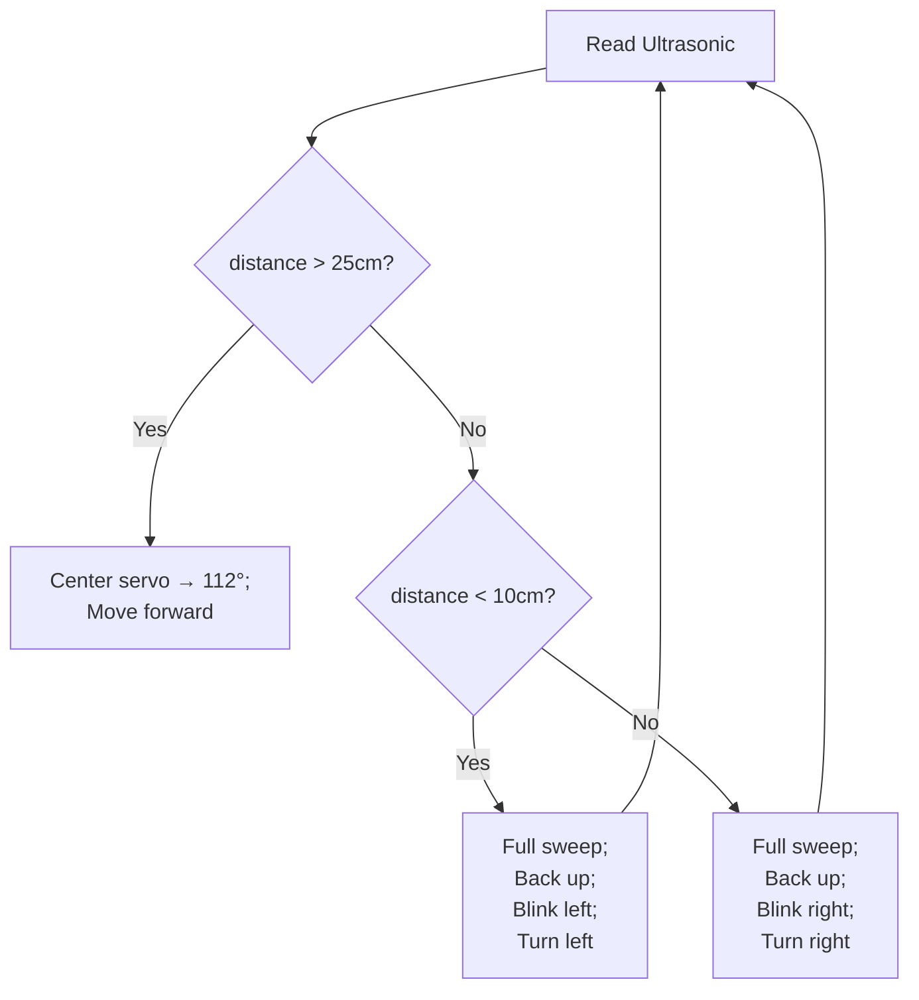

# Arduino 2 Wheel Obstacle avoiding Car 🤖🚗
## Project Overview

This two‑part Arduino project implements:
1. **Autonomous Obstacle‑Avoiding Robot**  
2WD robot that uses an HC‑SR04 ultrasonic sensor (mounted on a small servo) to detect and avoid obstacles in its path; it also features headlights controlled by an LDR and visual/audible feedback via LEDs and a buzzer.

2. **Bluetooth Manual‑Control Mode**  
Same 2WD platform can be driven via Bluetooth (e.g. HC‑05/HC‑06) using a mobile app or controller. Button presses (`'F'`, `'B'`, `'L'`, `'R'`, etc.) are sent over Serial and mapped to drive functions, plus headlight toggling.

---

## Hardware Components & Pinout

| Component            | Arduino Pin(s) | Notes                               |
|----------------------|----------------|-------------------------------------|
| HC‑SR04 Ultrasonic   | Trig → D3<br>Echo → D2 | Distance via pulse‑echo timing        |
| 9 g Servo            | Control → D9   | Sweeps ultrasonic sensor 20°–170°   |
| DC Motor Driver H‑Bridge (e.g. L298N) |  
• Left motor IN1 → D10 (MLa)<br>• Left motor IN2 → D11 (MLb)<br>• Right motor IN1 → D6 (MRa)<br>• Right motor IN2 → D5 (MRb) | Controls forward/backward & turns via digital HIGH/LOW |
| LDR (Light Sensor)   | A0             | Auto headlight ON/OFF threshold     |
| Buzzer               | (any PWM‑capable D) | Audio feedback patterns             |
| LEDs                 | (various D)    | KnightRider chase & turn‑indicator  |
| Bluetooth Module     | Rx → Tx0<br>Tx → Rx0 | Uses Serial at 9600 bps             |

_Common constants:_  
```c
int kr = 50;       // Base delay unit (ms) for LED/buzzer patterns
int LDRThreshold = 300;
const float SOUND_SPEED = 343.0; // m/s at 20 °C
````

---

> **Note:**  
> - Make sure you have the 10 kΩ pull‑down resistor on the LDR as shown.  
> - Power rails (5 V & GND) feed all modules.  
> - `D8`,`D7`,`D4` are example pins for buzzer and LEDs—match these to your code or swap as needed.

---

If you’d prefer a quick **ASCII‑style** sketch instead, here’s an alternate you can drop straight into any Markdown fence:

```plaintext
                +--------------------------------+
                |           Arduino Uno         |
                |                                |
     +5V ──────>│ 5V                          GND│<────┐
     GND ─────>│ GND                       RESET │     │
                |                                |     │
TRIG ←── D3 ───>│ D3/Trig HC‑SR04 Ultrasonic     |     │
ECHO ←── D2 ───>│ D2/Echo HC‑SR04 Ultrasonic     |     │
SERVO_SIG ────>│ D9 → Servo Signal              |     │
MD_IN1 ───────>│ D10 → MotorDRV IN1             |     │
MD_IN2 ───────>│ D11 → MotorDRV IN2             |     │
MD_IN3 ───────>│ D6  → MotorDRV IN3             |     │
MD_IN4 ───────>│ D5  → MotorDRV IN4             |     │
LDR_PIN ──────>│ A0  → LDR (w/ 10 kΩ to GND)     |     │
BUZ_PIN ──────>│ D8  → Buzzer                   |     │
LED_L ────────>│ D7  → LED (Left)               |     │
LED_R ────────>│ D4  → LED (Right)              |     │
BT_TX ────────>│ TX0 → Bluetooth RX             |     │
BT_RX ────────>│ RX0 → Bluetooth TX             |     │
                +--------------------------------+

```

## Ultrasonic Sensing Theory

1. **Trigger & Echo**

   * The HC‑SR04’s Trig pin is driven HIGH for 10 µs.
   * The module emits an ultrasonic burst and then raises Echo HIGH until the echo returns.
2. **Time‑of‑Flight → Distance**

   ```c
   duration = pulseIn(echoPin, HIGH);
   distance_cm = duration / 58.2;   // sound speed conversion → cm
   ```

   * Sound speed ≈ 343 m/s → 29.1 µs per cm for round‑trip, so one‑way is \~14.55 µs/cm. The common divisor 58.2 accounts for both directions.

---

## Servo‑Based Scanning

* **Center‑point at 112°**
  The code parks the servo at 112° when moving straight.
* **Obstacle Reaction**
  On detecting a close obstacle (< 10 cm or < 20 cm), the servo sweeps from 20° to 170° (in 1° steps) to visually “scan.”
* *Note:* In a fully featured design, you’d read `distance_cm` at each angle to choose the clearest direction; here, the sweep is primarily illustrative before turning.

---

## Motor & Drive Control

* **Forward/Backward**:

  * To move forward: set both MLa→HIGH, MLb→LOW, MRa→HIGH, MRb→LOW.
  * To reverse, swap each motor’s pin states.
* **Turning**:

  * **Left**: Stop or reverse the left wheel while the right wheel moves forward.
  * **Right**: Stop/reverse the right wheel while the left wheel moves forward.
* **Speed Control (optional)**:
  Can be added via PWM (`analogWrite`) instead of digital HIGH/LOW for smoother acceleration.

---

## Light Detection & Headlights

* **LDR on A0** yields an analog value (0–1023).
* **Threshold**:

  ```c
  int value = analogRead(A0);
  if (value < LDRThreshold) {
    HeadlightsOff();
  } else {
    HeadlightsOn();
  }
  ```
* **Headlights**
  Typically drive an LED or small lamp via a MOSFET or transistor stage for sufficient current.

---

## Buzzer & LED Feedback Patterns

* **KnightRider**: Alternating LEDs lit in sequence with sound pulses to indicate obstacle reaction.
* **BlinkLeft/BlinkRight**: Flash the left or right side LED multiple times before turning.
* **BuzzerKnightRider/BuzzerStop**: Coordinate buzzer tone bursts with LEDs.

These add user‑friendly feedback on state changes.

---

## Obstacle‑Avoidance Algorithm



* **Thresholds**

  * >  25 cm: clear path
  * < 10 cm: immediate U‑turn left
  * 10–20 cm: moderate turn right
* **Delays** use the global `kr` (50 ms) to pace each LED/buzzer step.

---

## Bluetooth Manual‑Control Mode

1. **Serial Command Map**
   Commands arrive as single ASCII chars:

   | Char              | Action                                            |
   | ----------------- | ------------------------------------------------- |
   | `'F'`             | Forward                                           |
   | `'B'`             | Backward                                          |
   | `'L'`             | Left turn                                         |
   | `'R'`             | Right turn                                        |
   | `'C','X','T','S'` | Custom patterns (circle, cross, triangle, square) |
   | `'A'`             | Start (headlights on)                             |
   | `'P'`             | Pause (headlights off)                            |
2. **Setup**

   ```c
   Serial.begin(9600);
   if (Serial.available()) {
     char cmd = Serial.read();
     switch(cmd) {
       case FORWARD:  MoveForward(); break;
       …
     }
   }
   ```
3. **Integration**

   * Swap the obstacle‑avoidance loop with this listener to drive manually.
   * On Manual mode exit, reattach servo/scanner logic.

---

## Future Improvements

* **Dynamic Scanning**: Read & compare distances at each servo angle to pick the best turn direction.
* **PID Speed Control**: Smooth acceleration/deceleration for stability.
* **Sensor Fusion**: Add IR sensors or a line‑tracker to support more complex navigation.
* **Mapping & SLAM**: Store obstacle positions for path planning.

---

> *This theoretical background should give you a clear understanding of how the code interfaces with hardware, the sensory‐driven control logic, and how manual override via Bluetooth is implemented. Feel free to extend each section with circuit diagrams, pin‑mapping tables, or flowcharts as needed!*

